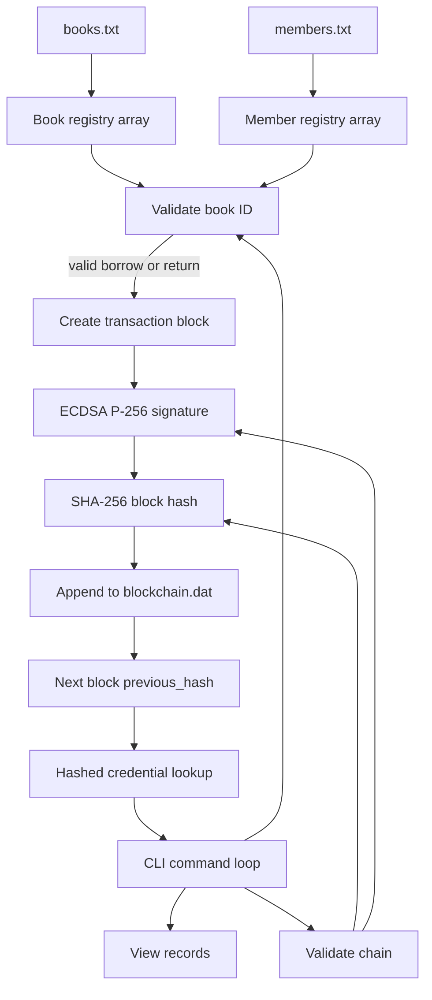

# System Design



## Block structure

```text
index        int
 timestamp    time_t
book_id      char[20]
book_title   char[80]
member_id    char[20]
member_name  char[50]
action       char[10]
previous_hash char[65]
signature    unsigned char[72]
signature_len unsigned int   (serialization metadata)
hash         char[65]
```

The signature covers the transaction fields through `previous_hash`. The SHA-256 block hash covers those fields plus the signature. The hash field is excluded because including it would create a circular value. Validation recomputes the hash, checks the previous block link, and verifies the signature with the persisted public material in the private key file.

## Lending flow

1. At startup, both registries must exist and contain at least one valid row.
2. A command is authenticated as the librarian.
3. The requested book and member IDs are looked up in the loaded arrays.
4. A borrow is accepted only if the book's latest lending state is not `BORROWED`.
5. A return is accepted only if the book's latest lending state is `BORROWED`.
6. The new block is signed, hashed, appended, and persisted.
7. Validation can be run at any time, and `tamper` provides an observable demonstration.
