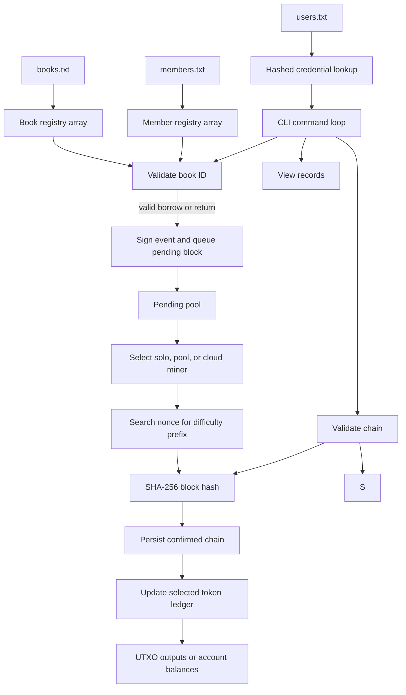

# System Design


```mermaid
flowchart TD
    A[books.txt] --> R[Book registry array]
    B[members.txt] --> M[Member registry array]
    C[users.txt] --> AUTH[Hashed credential lookup]
    AUTH --> CLI[CLI command loop]
    R --> V[Validate book ID]
    M --> V
    CLI --> V
    V -->|valid borrow or return| T[Sign event and queue pending block]
    T --> PP[Pending pool]
    PP --> MW[Select solo, pool, or cloud miner]
    MW --> POW[Search nonce for difficulty prefix]
    POW --> H[SHA-256 block hash]
    H --> P[Persist confirmed chain]
    P --> LEDGER[Update selected token ledger]
    LEDGER --> MODEL[UTXO outputs or account balances]
    CLI --> Q[View records]
    CLI --> X[Validate chain]
    X --> H
    X --> S
```

## Block structure

```text
index        int
 timestamp    time_t
book_id      char[20]
book_title   char[80]
member_id    char[20]
member_name  char[50]
action       char[10]
previous_hash char[65]
token_reward int                 (gross reward: 10, 5, or 0)
transaction_id char[65]          (SHA-256 reward transaction ID)
difficulty   int                 (leading zero hex characters)
nonce        unsigned long long
signature    unsigned char[72]
signature_len unsigned int   (serialization metadata)
hash         char[65]
```

The ECDSA signature covers the lending fields through `previous_hash`. On confirmation, the miner assigns the final index and previous hash and re-signs. The SHA-256 block hash covers the lending fields, signature, gross reward, reward transaction ID, difficulty, and nonce. Validation recomputes the hash, checks its zero prefix and previous-block link, and verifies the signature with the public key derived from the persisted private key.

## Lending flow

1. At startup, both registries must exist and contain at least one valid row.
2. A command is authenticated as the librarian.
3. The requested book and member IDs are looked up in the loaded arrays.
4. A borrow is accepted only if the latest confirmed or pending state is not `BORROWED`.
5. A return is accepted only if the latest state is `BORROWED` and the member is the borrower.
6. Returns receive a gross reward of 10 within the documented 14-day loan period or 5 afterward. The fixed one-token fee is deducted, and a SHA-256 transaction ID over member, book, action, gross reward, fee, and timestamp is included in the pending block.
7. Solo, pool, or cloud mining confirms every pending event by finding a nonce for the configured difficulty. A borrowed, unreturned overdue book produces no reward transaction.
8. The mined chain is persisted before rewards are applied. UTXO balances come from unspent outputs; account balances use per-member nonce counters and linked-list histories.
9. Manual transfers charge a one-token fee. UTXO transfers use inputs, recipient outputs, and change; account transfers require the exact next sender nonce. These manual transfers are in-memory examples and are not persisted.
10. Validation can be run at any time, and `tamper` provides an observable integrity failure.

## Mining and ledger assumptions

- Default difficulty is two leading hexadecimal zeroes; command-line range is one through four.
- Mining reward is two coins per confirmed block. Pool share is based on measured attempt counts after a 2% pool fee.
- Cloud rental simulates 1 to 5 rounds at 2 coins rental plus 1 coin maintenance per round against 2 coins gross reward per round.
- Confirmed return rewards are replayed from the chain at startup. The selected accounting model applies to all rewards and manual transfers for that process.
